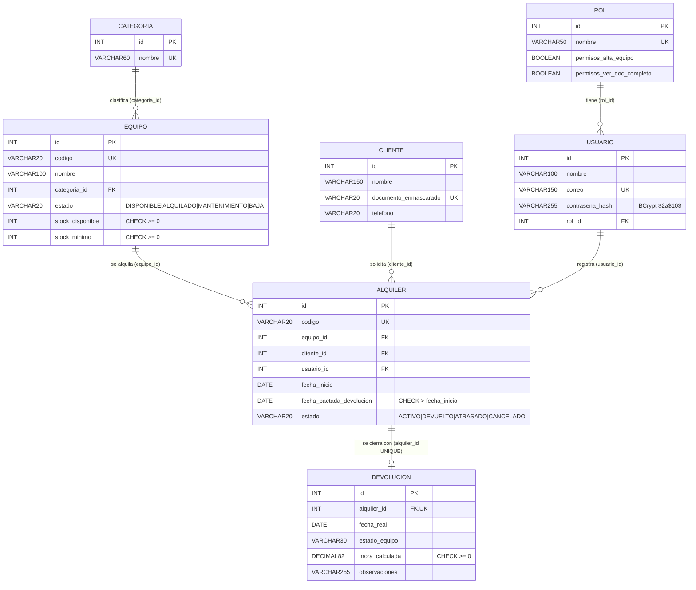

# Diagrama físico de la base de datos — RentaMax (MySQL 8 en Aiven)

Fuente de verdad: `database/schema_v1.sql`. Motor InnoDB, FK con restricciones nombradas, índices B-Tree
(UNIQUE y FK se indexan solos). Hibernate corre con `ddl-auto=validate` (no modifica las tablas).

## Conexión (pool HikariCP)

`maximum-pool-size=10` · `minimum-idle=5` · `connection-timeout=20000` · `idle-timeout=600000` · `max-lifetime=1800000`.
Credenciales solo por variables de entorno (`SPRING_DATASOURCE_URL/USERNAME/PASSWORD`, o `DB_URL/DB_USER/DB_PASSWORD`).
